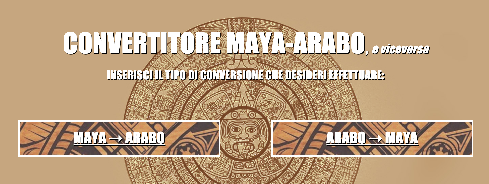

# Convertitore Arabo - Maya, versione 1.0

Progetto per il corso "Architettura degli Elaboratori e Laboratorio".
Trattasi di un convertitore numerico che consente di convertire, bidirezionalmente, i simboli Maya in numeri Arabi, e viceversa. Possiede inoltre una sezione "esercitazione", utile a spronare l'utente nel cimentarsi ad una eventuale conversione manuale.

Il progetto è provvisto di documentazione e interfaccia web sviluppata mediante l'utilizzo dei linguaggi: HTML, CSS e JavaScript.
